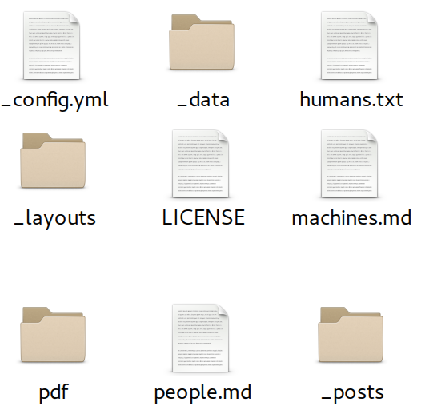

  ---
title: Data sharing
author: DataONE Community Engagement & Outreach
update: Sept. 20, 2016
layout: slides
---

# Lesson topics

.three-fourth[
- Data sharing within the data lifecycle
- Value of data sharing
- Concerns about data sharing
- Methods for making data sharable
]

.one-fourth[

.legend[Legend for this figure]
]

---

# Learning objectives


**After completing this lesson,** the participant will be able to

- discuss data sharing considerations within the data lifecycle
- recognize the benefits of sharing scientific data
- address concerns about sharing data
- outline a process for making data sharable
- identify mechanisms for sharing data

---

# Markdown 101

.one-half[
- `*italics*` is *italics*
- `**bold**` is **bold**
- `***bold italics***` is ***bold italics***
]

.one-half[
Lists:

~~~
- List item 1
- List item 2
  - Nested list item

1. Enumerated list
2. Second item
  - We can mix both
~~~
]

---

# Quotes

~~~
> Text goes here
~~~

> Text goes here

---

# Syntax highlighting

``` md
~~~ R
<your code here>
~~~
```

renders as

~~~ R
random_thing <- function(x, r, ...) {
  return(r(x, ...))
}

plot(random_thing(100, runif))
~~~

You can also put code inline, using backticks:

~~~ md
This is `inline` code.
~~~

---

# Tables

.one-half[
Markdown can do tables:

~~~ md
|   Animal | Diet      | Fuzzy? |
|---------:|:----------|:------:|
| Hedgehog | rings     |   no   |
|   Racoon | garbage   |  meh   |
|      Cat | hairballs |  yup   |
~~~
]

.one-half[
This renders as:

|   Animal | Diet      | Fuzzy? |
|---------:|:----------|:------:|
| Hedgehog | rings     |   no   |
|   Racoon | garbage   |  meh   |
|      Cat | hairballs |  yup   |
]

---

# Notes

.one-third[
Notes are everything that comes below `???`. Press **P** to toggle presenter
mode.
]

.two-third[
~~~ md
Notes are everything that comes below `???`.
Press **P** to toggle presenter mode.

???

These are the notes, and *they can* be in markdown too.
~~~
]

???

These are the notes, and *they can* be in markdown too.

**It is very important** that the notes are the *last* things on the slide.

Look a table!

| x | y |
|:--|:--|
| 1 | 2 |
| 3 | 4 |

---

# Columns

.two-third[

It is possible to have columns or various widths in the presentation. The
columns should be wrapped the following way:
~~~
.one-third[
  content
]
~~~

You can chain columns in any way you want, *e.g.* 1/3 then 2/3, 1/4 then 1/2
then 1/2. As long as it sums to one, it's fine.

]

.one-third[
**Possible values**

- `.one-third`
- `.two-third`
- `.one-half`
- `.one-fourth`
- `.three-fourth`
- `.full-width`
]

---

# Nested columns

.three-fourth[

This is a three-fourth column, and splitted in two.

.one-half[
~~~ R
for (i in c(1:10)) {
  print(i)
}
~~~
]
.one-half[
~~~ julia
for i in 1:10
  print(i)
end
~~~
]

Then the column resumes after the split.

]

.one-fourth[
**It works!**
]
