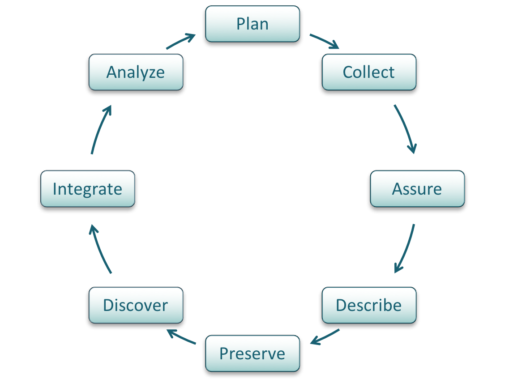

..
---
title: Data Management Planning
update: Sept. 20, 2016
layout: slides
categories: ed-module
---

# Lesson Topics

.two-third[
- What is a data management plan (DMP)?
- Why prepare a DMP?
- Components of a DMP
- Recommendations for DMP content
- Example of an NSF DMP
]

.one-third[

]

<!-- These are notes for the presenter -->
???  

- The topics covered in this module will answer the questions: 
- What is a data management plan, or DMP? 
- Why would you want to prepare a DMP? 
- What are the components of a DMP? And
- What are the requirements for DMPs prepared for National Science Foundation (or NSF) proposals?  
- We will also go over an example of a data management plan.

---

# Learning Objectives

.two-third[
- After completing this lesson, the participant will be able to:
  - Define a DMP
  - Understand the importance of preparing a DMP
  - Identify the key components of a DMP
  - Recognize the DMP elements required for an NSF proposal
]

.one-third[
 
]

---

# The Data Life Cycle

*Photo Attribution: https://www.dataone.org/data-life-cycle*

<!-- These are notes for the presenter -->
??? 

Data management planning is the starting point in the data life cycle. 
However the plan should be revisited often throughout the project to ensure proper data documentation and management.

---

# What is a Data Management Plan?

- Formal document 
- Outlines what you will do with the data **during** and **after** you complete your research
- Ensures the data is safe for the **present** and the **future**

*From University of Virginia Library*

<!-- These are notes for the presenter -->
???

A DMP is a formal document that outlines what you will do with the data both during and after your research project.  
Data management plans are meant to ensure that the data will be preserved and useful both now and in the future, by both you and other researchers. They should be considered an active doucment, and updated throughout the project to reflect changes in needs or practice.

---

# Why Prepare a DMP? (1)

.two-third[
- Save time
  - Less reorganization later
- Increase research efficiency
 - Ensures you and others will be able to understand and use data in future
]

.one-third[
]

<!-- These are notes for the presenter -->
???

Why would you want to prepare a data management plan? First and foremost, they save you time. If your data organization scheme is decided on early in the project, or even before data collection begins, you are less likely to spend time organizing the data later. 

Second, preparing a plan for data organization and storage allows you to focus on your research, increasing your efficiency. You are better able to locate and use the data, and share them with collaborators.

If data are documented well both before and during data collection, it prevents problems in understanding data and metadata in the future.

---

