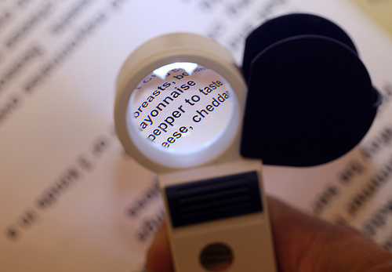

# Tutorials on Data Management

### Lesson 5: Data Quality Control and Assurance

*CC image by Shane Melaugh on Flickr*

---

# Lesson Topics

.one-half[
Definitions
* Quality assurance and Quality control
* Data contamination
* Types of errors

QA/QC best practices
* Before data collection
* During data collection/entry
* After data collection/entry
]

.one-half[

*CC image by cobalt123 on Flickr*
]

???

First we will define quality assurance and quality control, and review definitions for other related terms including data contamination, and review the common types of errors in data. Then we will review some best practices that can be implemented before data collection, during data collection, and after data collection to ensure high-quality data. 

---

# Learning Objectives

After completing this lesson, the participant will be able to: 
* Define data quality control and data quality assurance
* Perform quality control and assurance on their data at all stages of the research cycle

*CC image by 0xFCAF on Flickr*

???

After completing this module, you will be able to define quality control and quality assurance.  You will also understand how to perform quality control and assurance on your data at all stages of the data life cycle.  

---

# The Data Life Cycle

*DataONE Life Cycle*

???

Quality control and quality assurance should be implemented throughout the data life cycle, but here we focus on measures that can be taken during collection.  The “assure” step in the data life cycle closely ties in with QAQC measures.

---
