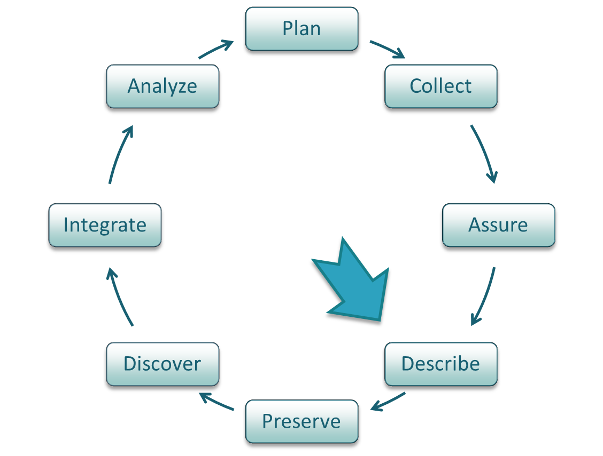

# Tutorials on Data Management: 

## Lesson 8: Data Citation

*Image attribution: CC image by adesigna on Flickr*

---

# Lesson Topics

* Data Citation in the Data Life Cycle
* Definitions: What is Data Citation?
* Benefits of Data Citation
* Collaborating to Support Data Citation
* How to Cite Data
* How to Obtain a Persistent Identifier for a Data Set
* Best Practices to Support Data Citation

*Image attribution: CC image by cybrarian77 on Flickr*

---

# Learning Objectives

After completing this lesson, the participant will be able to:
* Define data citation
* Describe benefits of data citation
* Identify roles of data authors/managers, data publishers, and journal publishers in supporting data citation
* Recognize metadata elements useful for data citation
* Recognize common persistent data locators and describe the process for obtaining one
* Summarize best practices for supporting data citation

---

# The Data Life Cycle

???

The Data Life Cycle is a continuum of data development, manipulation, management, and storage stages. Data citation is part of the "Describe" phase of the Life Cycle, though it is also related to Preservation and Discovery.

---

# Definitions

## Data citation
* "The practice of providing a reference to data in the same way as researchers routinely provide a bibliographic reference to printed resources"1
* "A key practice underpinning the recognition of data as a primary research output rather than as a by-product of research"1

## Data author
* "Individual involved in research, education, or other activities that generate digital data that are subsequently deposited in a data collection"2

## Persistent identifier
* A unique web-compatible alphanumeric code that points to a resource (e.g., data set) that will be preserved for the long term (i.e., over several hardware and software generations)
* Should direct to latest available version of resource or to metadata which enables acquisition of desired version or format

???

1. Australian National Data Service (ANDS), Data Citation Awareness Guide. Accessed May 10, 2012 at http://ands.org.au/guides/data-citation-awareness.html. 

2. National Science Board, Long-Lived Digital Data Collections: Enabling Research and Education in the 21st Century, September, 2005. p. 17. http://www.nsf.gov/pubs/2005/nsb0540/ Accessed May 10, 2012.

3. Hakala, J. Persistent identifiers – an overview. Accessed May 10, 2012 at http://metadaten-twr.org/2010/10/13/persistent-identifiers-an-overview/.

---

# Benefits of Data Citation 

## Short term
* Facilitates discovery of relationships between data and publications, making it easier to validate and build upon previous work
* Ensures that proper credit can be given when others use your work
* Facilitates impact assessments of datasets based on number of publications that cite them
* Helps researchers re-using data to find other ways the data has been used.

*Image attribution: CC image by futureatlas.com on Flickr,as "Citation Needed"*
 
---

# Benefits of Data Citation

## Long term
* Promotes the availability of data into the future
* Facilitates discovery of  existing data relevant to a particular question
* Enables recognition of scholarly effort within disciplines and organizations 
* Increases transparency of scientific research

*Image attribution: CC image by gruntzooki on Flickr*

???

Adoption of practices that rely on publishing infrastructure help to ensure data will be available in the future --- is this really true? I reworded it, but just thinking about it…nothing is guaranteed…?
Prevents ‘data stealing’ because rules of publication apply to citable data in that it must be cited or treated as plagiarism….
Easier to discover existing data relevant to a particular question

---

# Principles of Data Citation

* **Importance** - Data should be considered legitimate, citable products of research
* **Credit and Attribution** - Data citations should facilitate giving scholarly credit and normative and legal attribution to all contributors to the data
* **Evidence** - In scholarly literature, whenever and wherever a claim relies upon data, the corresponding data should be cited.
* **Unique Identification** - A data citation should include a persistent method for identification that is machine actionable, globally unique, and widely used by a community.

*https://www.force11.org/datacitation*

---

# Principles of Data Citation

* **Access** - Data citations should facilitate access to the data, metadata, code, and other materials, as necessary for both humans and machines.
* **Persistence** - Unique identifiers, data, and metadata should persist beyond the lifespan of the data they describe.
* **Specificity and Verifiability** - Data citations should facilitate identification of, access to, and verification of the specific data that support a claim.  
* **Interoperability and Flexibility** - Data citation methods should be flexible, but enable interoperability across communities.

*https://www.force11.org/datacitation*

---

# How to Cite Data

---

# Examples of information needed in a citation 

---

# Examples of information needed in a citation, continued

---

# Examples of Data Citation Formats

* **DataCite**: Creator (Publication Year): Title. Publisher. Identifier
* **Dryad**: Author (Date of Article Publication) Data from: Article name. Dryad Digital Repository. doi: DOI number

