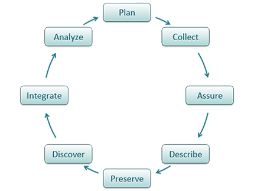

# Lesson Topics
- Review of typical data analyses
- Reproducibility & provenance
- Workflows in general
- Informal workflows
- Formal workflows

???
The topics covered in this tutorial will include a review of typical data analyses, reproducibility, provenance,
workflows in general, and both informal and formal workflows

---
# Learning Objectives
After completing this lesson, the participant will be able to: 
- Understand a subset of typical analyses used
- Define a workflow
- Understand the concepts informal and formal workflows
- Discuss the benefits of workflows 

???
After completing this lesson you will be able to understand a subset of typical analyses used by ecologists and environmental scientists. You will be able to define a workflow and understand the basic concepts of both formal and informal workflows. Lastly you will able to discuss the benefits of using a workflow. 

---
# The Data Life Cycle

???

In this tutorial we will be focusing on data analysis which appears here in the data life cycle. Analysis can be performed on original data collected by a researcher, or on data ‘discovered’ in data repositories and integrated.
 

---
