# Lesson Topics

.one-half[* Review of typical data analyses
* Reproducibility & provenance
* Workflows in general
* Informal workflows
* Formal workflows]

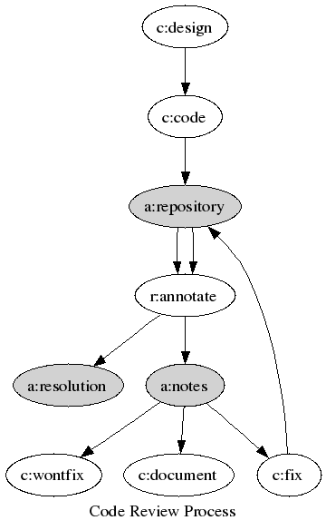

???
The topics covered in this tutorial will include a review of typical data analyses, reproducibility, provenance,
workflows in general, and both informal and formal workflows

---
# Learning Objectives
After completing this lesson, the participant will be able to: 
- Understand a subset of typical analyses used
- Define a workflow
- Understand the concepts informal and formal workflows
- Discuss the benefits of workflows 

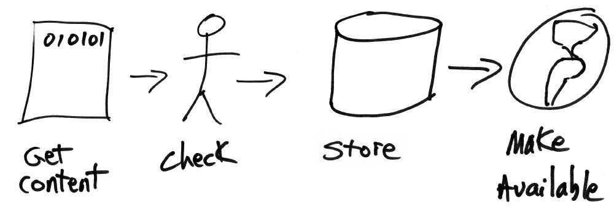

???
After completing this lesson you will be able to understand a subset of typical analyses used by ecologists and environmental scientists. You will be able to define a workflow and understand the basic concepts of both formal and informal workflows. Lastly you will able to discuss the benefits of using a workflow. 

---
# The Data Life Cycle

.center[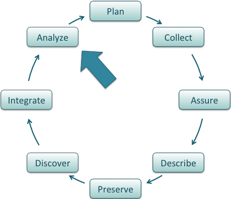]

???
In this tutorial we will be focusing on data analysis which appears here in the data life cycle. Analysis can be performed on original data collected by a researcher, or on data ‘discovered’ in data repositories and integrated.
 

---
# Data Analyses
**Processes:**
- Conducted via personal computer, grid, cloud computing
- Statistics, model runs, parameter estimations, graphs/plots, etc.

.one-half[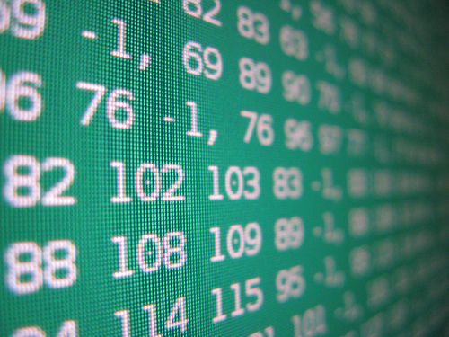]

.one-half[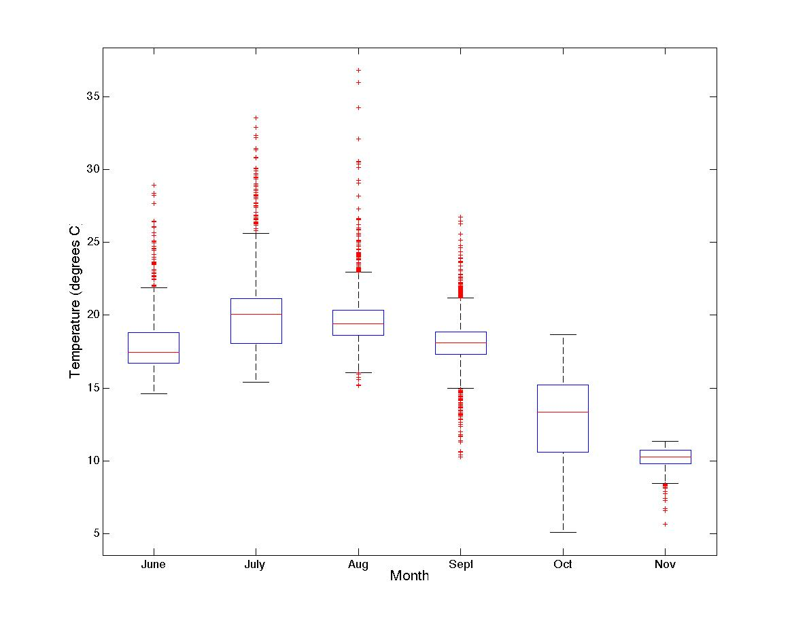]

???

The types of analyses, software, and hardware used by ecologists and environmental scientists vary widely.  Personal computers are commonly used to perform these analyses. Other computational tools are grid and cloud computing.
 
Grid computing integrates large-scale resources such as computational devices, data applications, and scientific instruments to understand and explore research questions efficiently. It is also commonly used to share, manage, and process large datasets in physics, geophysics, astronomy, and bioinformatics.  
 
Cloud computing is location-independent computing, whereby shared servers provide resources, software, and data to a various number of external computers located elsewhere.
 
Examples of data analyses that might be used with any of these computational tools are statistics, model runs and simulations, parameter estimations, plotting of spatial data, or visualizations such as graphs. The types of analyses vary widely both among and within scientific areas of study.

---
# Types of Analyses
Processing: subsetting, merging, manipulating
  - Reduction: important for high-resolution datasets
  - Transformation: unit conversions, linear and nonlinear algorithms
 
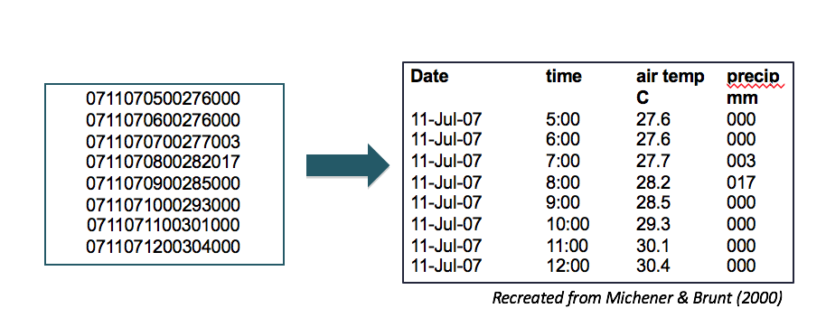 
  
???
Typically the first step in any data analysis is processing the data. Processing can include selecting a subset of the data for analysis, merging multiple datasets, or manipulating the data so it is more useable by a researcher or a computer program.  
 
A common requirement for large datasets is to reduce the amount of data in the working data file. This makes computing and handling of the dataset easier.  For example, a sensor might take a temperature measurement every 5 seconds for one year.  For the study, only monthly patterns are important. We might therefore only use one data point for every 5 minutes. 
 
Data will also need to be transformed before use.  This might involve the conversion of data to common units, normalization of data collected by multiple people and instruments, or developing algorithms for converting raw data into meaningful values. 
 
An example of data transformation is shown here, the relatively meaningless string of numbers on the left, which were raw output from a sensor, can be transformed into the table on the right, which is more understandable for humans.

---
# Types of Analyses
**Graphical analyses**
  * Visual exploration of data: search for patterns
  * Quality assurance: outlier detection
  
???
Another way to analyze data is by visually representing it.  Numbers in charts can be difficult to interpret but patterns can be readily apparent in a few well-chosen graphs or other visual representations.
 
Examples of different types of plots are scatter plots and Box-and-whisker plots, which show the statistical distribution of data. 
 
On the left is a scatter plot of temperatures for the month of August. The general pattern is easily discernable, and particularly warm measurements are readily apparent.
 
On the right is a box-and whisker plot of monthly temperatures. The boxes indicate averages, and measurements far from the averages are visible as red dots outside of the error bars.
 
Plots can be used to assure the quality of data as well. They can quickly show you potential data errors such as impossible values.

---
# Statistical Analyses

.two-third[ **Conventional Statistics**
 * Experimental data
 * Examples: ANOVA, MANOVA, linear  and nonlinear regression
 * Rely on assumptions: random sampling, random & normally distributed error, independent error terms, homogeneous variance
 
**Descriptive Statistics**
 * Observational or descriptive data
 * Examples: diversity indices, cluster analysis, quadrant variance, distance methods, principal component analysis, correspondence analysis
   ]
 .one-third[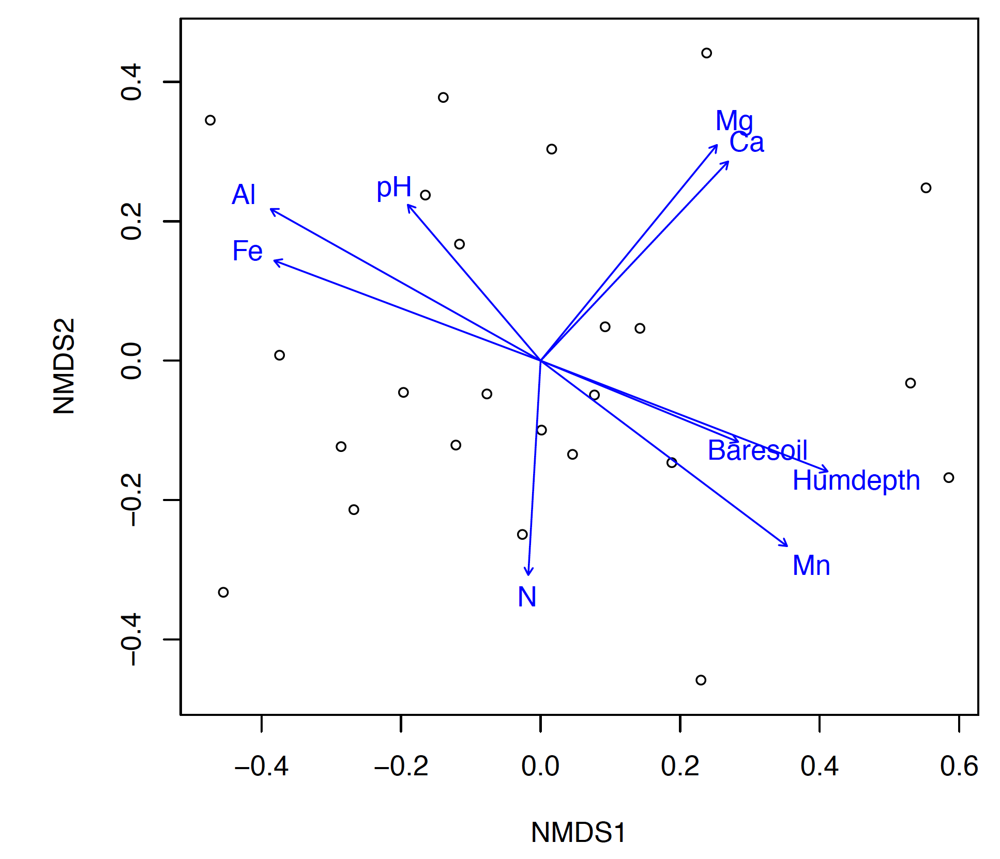] 
   <image caption>*From Oksanen (2011)  Multivariate Analysis of Ecological Communities in R: vegan tutorial*</image caption>

???
Statistics are among the most common types of analyses performed on data. 
 
There are many different types of statistical analyses, only a few of which we show here.  Conventional statistics are often used to understand experimental data. The most common types are analysis of variance (ANOVA), multivariate analysis of variance (MANOVA), and regressions. Conventional statistics tend to rely on assumptions such as random error and homogeneous variance. 
 
Descriptive statistics are traditionally applied to observational or descriptive data. Descriptive data might include the distribution of organisms in space, species-abundance relationships, inter-specific associations, community structure, similarity or dissimilarity, and community-habitat relationships. Statistics used to understand these types of data include diversity indices, cluster analysis, and principle components analysis, among many others

---
# Types of Analyses
**Statistical analyses (continued)** 
* Temporal analyses: time series
* Spatial analyses: for spatial autocorrelation
* Nonparametric approaches useful when conventional assumptions violated or underlying distribution unknown
* Other mis. analyses: risk assessment, generalized linear models, mixed models, etc.

**Analyses of very large datasets**
* Data mining and discovery
* Online data processing
  
???
Statistical analyses might also include temporal or spatial analyses, and nonparametric approaches which do not rely on specific assumptions about the data’s distribution, and many other types of analysis, including risk assessment and GLM’s.
 
Analyzing very large datasets requires special considerations.  The process can often be broken into two steps. 
The first involves discovering and mining for the data of interest. This is typically done via computers and involves pattern searching and the use of decision trees.
The second step involves online data processing. Large datasets can be analyzed using high-performance computing systems such as cloud computing.

---
# After Data Analysis
**Re-analyze outputs**
* Final visualizations: charts, graphs, simulations, etc

**Science is iterative: 
The process that results in the final product can be complex**

???
The process is often modified based on analyses and re-run with small (or large) changes. 
Science is inherently an iterative process. We run analyses, modify hypotheses, and re-run analyses. This can result in a complex process that results in the final product.

Based on results from preliminary analysis, a researcher will often re-run or re-analyze the data or outputs. 
 
---
# Reproducibility
Reproducibility at core of scientific method
* Complex process = more difficult to reproduce
* Good documentation required for reproducibility
 * Metadata: data about data
 * Process metadata: data about process used to create, manipulate, and analyze data
 .center[]

???
Reproducibility is at the core of scientific method.  If results are not reproducible, the study loses credibility. The complex processes used to create final outputs can be quite difficult to reproduce.  In order to maintain scientific integrity, good documentation of the data and the analytical process is essential. Documentation includes metadata, which is data about data, and process metadata, which is data about the process.
---
# Ensuring Reproducibility: Documenting the Process
- Process metadata: Information about process (analysis, data organization, graphing) used to get to data outputs
- Related concept: data provenance
 - Origins of data
 - Good provenance = able to follow data throughout entire life cycle
 - Allows for 
  - Replication & reproducibility
  - Analysis for potential defects, errors in logic, statistical errors
  - Evaluation of hypotheses

???
Process metadata is information about the process used to create any data outputs. This includes any data cleaning, transformation, reduction, and any analyses performed.A related concept to process metadata is “data provenance”. Provenance means “origin”, so data provenance is a description of the origins of the data.A mark of good provenance is that a person not directly involved with the project is able to follow the data through its life cycle and understand any steps used to create outputs.Good provenance allows for the ability to replicate analyses and reproduce results. Others can identify potential problems, logical, or statistical errors that might affect the study’s outcome.  Others are also able to evaluate a study’s hypotheses for themselves.   All of these possibilities mean greater accountability and more trustworthy science. 
---
# Workflows: The Basics
- Formalization of process metadata
- Precise description of scientific procedure
- Conceptualized series of data ingestion, transformation, and analytical steps
- Three components
 - Inputs: information or material required
 - Outputs: information or material produced & potentially used as input in other steps
 - Transformation rules/algorithms (e.g. analyses)
- Two types:
 - Informal 
 - Formal/Executable

???
A workflow is a formalization of the process metadata. Workflows are commonly used in other fields, including business. In general, a “workflow” is a precise description of the procedures used in a project. It is a conceptualized series of data ingestion, transformation, and analytical steps.A workflow consists of three components. First, there are inputs that contain the information required for the process, for example the raw data. Second the output is information or materials produced, such as final plots of the data. Third, there are transformation rules, algorithms, or analyses that are required to create the outputs from the inputs.
 
 
---

# Informal Workflows

.one-third[
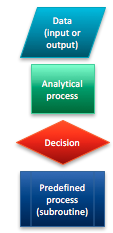]

- **Inputs or outputs** include data, metadata, or visualizations
- **Analytical processes** include operations that change or manipulate data in some way
- **Decisions** specify conditions that determine the next step in the process
- **Predefined processes** or subroutines specify a fixed multi-step process

???
Mention that example workflow diagrams shown here were drawn freehand in PowerPoint using default flowchart symbology – no specialized software necessary!

---

# Informal Workflows
**Workflow diagrams:**  Sample linear flow chart
 - Conceptualizing analysis as a sequence of steps
 - arrows indicate flow
  
  .center[]
  
---
# Informal Workflows
**Flow Charts:** a simple form of workflow

.center[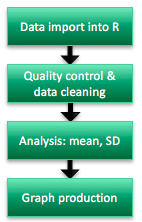]

???
This is an example of a simple conceptual workflow. Here we focus on the analytical steps used to create outputs from the data.  In the first step the data are imported into a scripted program, R, for cleaning and analysis.
The data then go through a quality control and cleaning process to identify outliers, remove erroneous data, and identify any missing data.
The data are then analyzed to generate mean temperature and salinity for the location, as well as error envelopes for the data.
Finally, graphs are produced to display the resulting mean temperatures. 

---
# Informal Workflows
**Transformation Rules**
.center[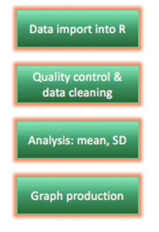]

 
 These steps are known in workflows as “transformation rules”.  Transformation rules describe what is done to/with the data to obtain the relevant outputs for publication. 

---
# Informal Workflows
**Flow charts:** simplest form of workflow
Inputs and Outputs
 
 .center[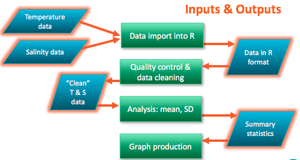]
 

???
The Inputs & outputs of this workflow are shown here in red.
The first inputs are the raw temperature & salinity data. These are imported into R.The output of this process is the data in R format. 
That data in R format then become the input for the quality control and data cleaning step. 
The output of this step is “clean” temperature and salinity data, which is then the input for the analysis step.
The output of the analysis step is the summary statistics, such as mean and standard deviation by month. These are subsequently the inputs for the visualization step. 

---
# Informal Workflows
** *Workflow diagrams: adding decision points* **

 .center[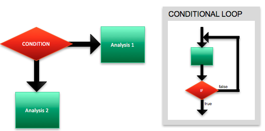]

---
# Informal Workflows

.center[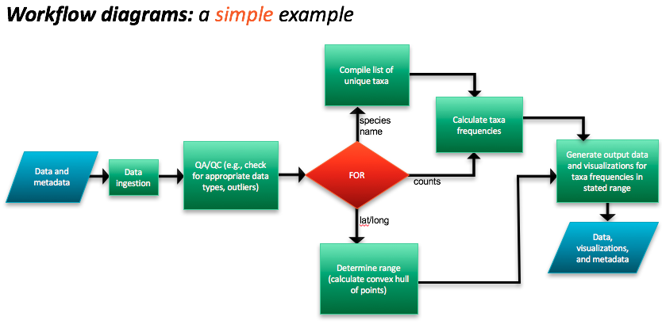]

---
# Informal Workflows

.center[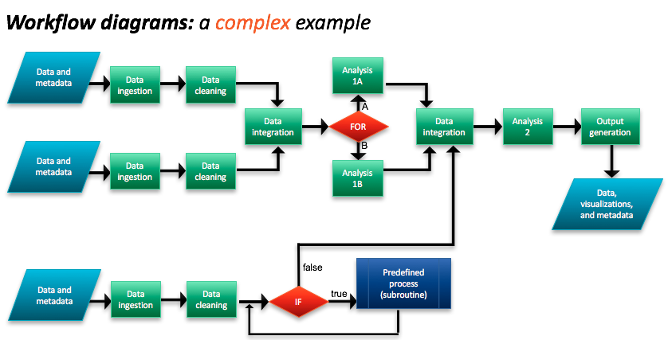]

---
# Informal Workflows
**Commented scripts are best practice** 
- Well-documented code is easier to review, share, enables repeated analysis
- Add high-level information at the top
 - Project description, author, date
 - Script dependencies, inputs, and outputs
 - Describes parameters and their origins
- Notice and organize sections
 - What happens in the section and why
 - Describe dependencies, inputs, and outputs
- Construct “end-to-end” script if possible
 - A complete narrative
 - Runs without intervention from start to finish

---
# Formal/Executable Workflows
**Analytical pipeline**
- Each step can be implemented in different software systems
- Each step & its parameters/requirements formally recorded
- Allows reuse of both individual steps and overall workflow

???
Formal Scientific workflow systems are now in development to help scientists document their workflows.  These analytical pipelines will make it possible for lay scientists to use workflows effectively for documenting their process metadata.  Each step within the scientific workflow system can be implemented using different software systems.  In the process of performing analyses, each step and its parameters and requirements are formally recorded. This allows both the individual steps and the overall workflow to be reused, either by the original scientist or someone else.

---
# Formal/Executable Workflows
**Benefits**
- Single access point for multiple analyses across software packages
- Keeps track of analysis and provenance: enables reproducibility
 - Each step & its parameters/requirements formally recorded
- Workflow can be stored
- Allows sharing and reuse of individual steps or overall workflow
 - Automate repetitive tasks
 - Use across different disciplines and groups
 - Can run analyses more quickly since not starting from scratch

???
There are many benefits of using scientific workflows. 
First, they can provide a single access point for multiple analyses across software packages. 
Second they allow a researcher to keep track of analyses conducted, which enables reproducibility.  
Third, workflows can be stored as documentation of the research project. A stored workflow is essentially higher-level metadata which offers tremendous potential for scientific advancement.
Finally, workflows allow researchers to share and reuse the workflow or its components. This means less time doing repetitive tasks, allows for collaboration across disciplines, and rapid analysis since time is not spent “reinventing the wheel”. 

---
# Formal/Executable Workflows: Kepler Software
**Example: Kepler Software**
- Open-source, free, cross-platform
- Drag-and-drop interface for workflow construction
- Steps (analyses, manipulations etc) in workflow represented by “actor”
- Actors connect from a workflow
- Possible applications
 - Theoretical models or observational analyses
 - Hierarchical modeling
 - Can have nested workflows
 - Can access data from web-based sources (e.g. databases)
- Downloads and more information at kepler-project.org

???
One example of a scientific workflow software program is Kepler. Kepler is an open-source and free cross-platform program. Cross-platform means it can work with any operating system.  
Kepler uses a drag-and-drop interface for scientists to construct their workflow. Steps in the analytical process are represented by an “actor”. These actors then connected to form a workflow.  Possible applications of Kepler are listed here.

---
# Formal/Executable Workflows: Kepler Software

.center[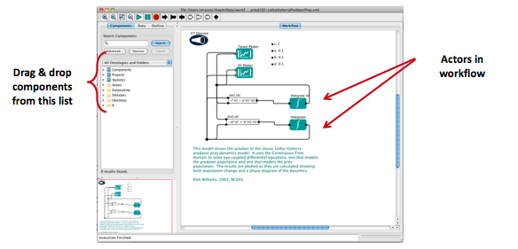]

???
Here is a screenshot of the Kepler interface. It has a user-friendly GUI (pronounced gooey) or graphical user interface.
The list of possible actors is searchable, and you can drag and drop the actors into the workflow creation space to the right.
Actors are connected via inputs and outputs represented by black lines.

---
# Formal/Executable Workflows: Kepler Software

.center[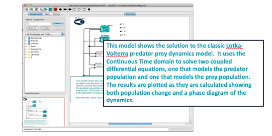]

???
This example workflow solves two coupled equations, one for the predator population, and one for the prey population. The solutions to the equations are then routed to the “Timed plotter” and “XY plotter” in the top of the panel. The text describes what this workflow is calculating.

---
# Formal/Executable Workflows: Kepler Software

.center[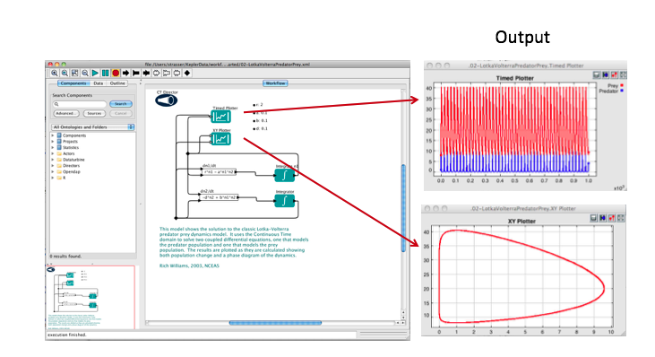]

???
The resulting outputs from this workflow are plots of the predator and prey populations. Kepler and other scientific workflow tools are being developed for use by ecologists and environmental scientists who may not be comfortable creating scripted workflows using the command line. 
Along with scientific workflows, tools are being developed to facilitate their use, such as VisTrails.

---
# Formal/Executable Workflows: VisTrails

.one-half[
- Open source
- Workflow and provenance management support
- Geared toward exploratory computational tasks
 - Can manage evolving SWF
 - Maintains detailed history about steps and data
- www.vistrails.org]
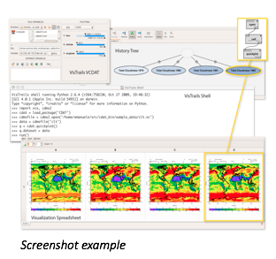

???
VisTrails is another example of an open source workflow tool that provides provenance and management support. VisTrails is an open source workflow tool that provides provenance and management support. It is geared toward exploratory and computational tasks. Using Vistrails, scientists can manage evolving scientific workflows and maintain detailed history about the steps taken and the data consumed and produced.

---
# Workflows in General
Science is becoming more computationally intensive
* Sharing workflows benefits science
* Scientific workflow systems make documenting workflows easier
* Minimally: document your analysis via informal workflows
* Emerging workflow applications (formal/executable workflows) will
 * Link software for executable end-to-end analysis
 * Provide detailed info about data & analysis
 * Facilitate re-use & refinement of complex, multi-step analyses
 * Enable efficient swapping of alternative models & algorithms
 * Help automate tedious tasks

???
Workflows are beneficial because they document the exact process used to create data outputs.   This is especially true with the advent of more computationally intensive processes due to sensor networks, complex statistical programs, and integration of many types of data in a single study.

One of the major advantages of workflows is they allow the analytical process to be shared with other scientists.  This would be easier to accomplish if there was a formal way of creating and saving workflows.

There are now scientific workflow systems in development that will make documenting workflows easier.  This will also increase the ability to share workflows with others. 

The simplest form of a scientific workflow is using scripts to document the process of analysis. This is done often using scripted programs such as R or Matlab, or if multiple software packages are used, via the command line using programming languages such as Java, Python, or Perl.  However executing codes and analyses via the command line is beyond the expertise of many ecological and environmental scientists.  

---
# Best Practices for Data Analysis
Scientists should document workflows used to create results
- Data provenance
- Analyses and parameters used
- Connections between analyses via inputs and outputs
- Documentation can be informal (e.g. flowcharts, commented scripts) or formal (e.g. Kepler, VisTrails)

???
Best practices for data analysis should involve the documentation of workflows, either conceptual or formal, to show how results were obtained. This includes data provenance, analyses used, parameters used, and connections between analyses via inputs and outputs.  
This documentation can be informal, like in a flowchart, or more formal, such as Kepler or vistrails. 

---
# Summary
Modern science is computer-intensive
 - Heterogeneous data, analyses, software
Reproducibility is important
- Workflows = process metadata
- Use of informal or formal workflows for documenting process metadata ensures reproducibility, repeatability, validation

???
In summary, modern science is becoming more and more computationally-intensive, and scientists are working with heterogeneous data, analyses, and software.  Reproducibility is more important than ever given this environment.
Workflows are equivalent to  process metadata, also known as provenance.
Using both informal and formal workflows and are necessary for reproducibility, repeatability, and validation of your research.

---
# Resources for Data Analysis & Workflows

W. Michener and J. Brunt, Eds. Ecological Data: Design, Management and Processing. (Blackwell, New York, 2000).

---
# About
Participate in our GitHub repository: [https://github.com/DataONEorg/Education](https://github.com/DataONEorg/Education)

**Suggested citation:**
DataONE Education Module: Data Analysis and Workflows. DataONE. Retrieved November 12, 2016. From [https://dataoneorg.github.io/Education/](https://dataoneorg.github.io/Education/)

**Copyright license information:**
No rights reserved; you may enhance and reuse for your own purposes.  We do ask that you provide appropriate citation and attribution to DataONE.

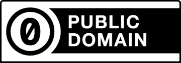

 

