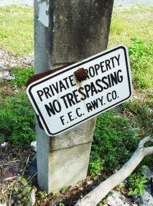
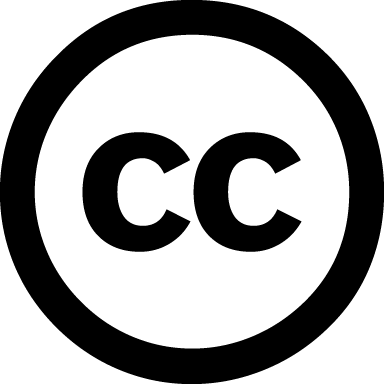
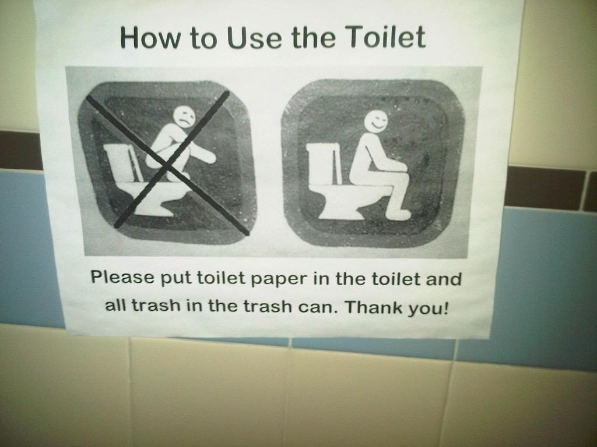
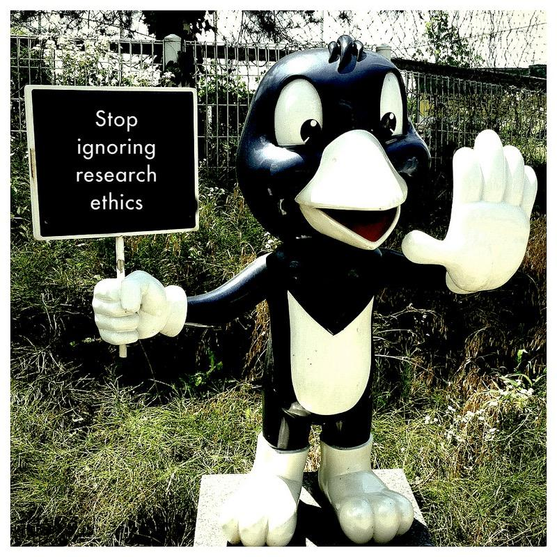
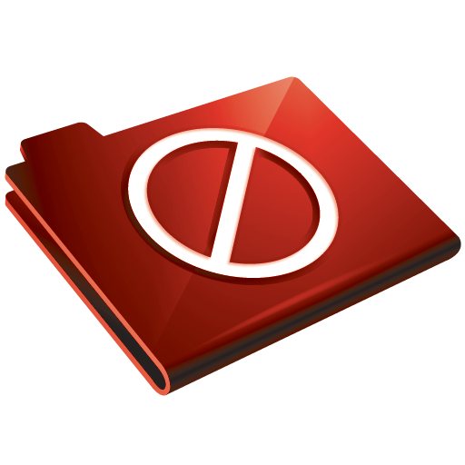
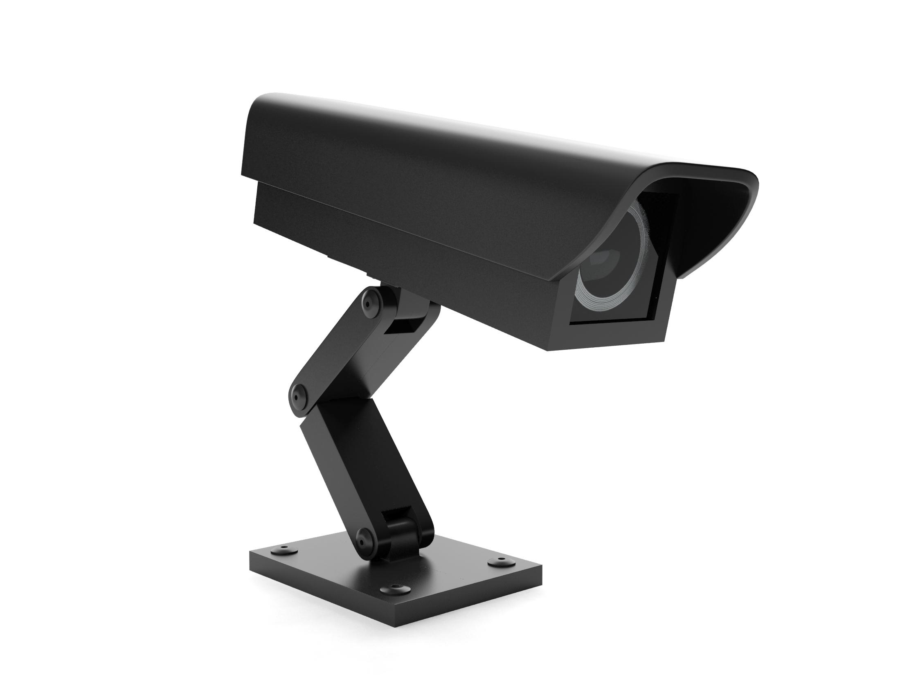

class: center, middle
# Legal and Policy Issues

.three-fourth-center[
  *Image Attribution: http://www.therealestatemedia.com/wp-content/uploads/2012/05/real-estate-investment-scam.jpg*
  ]
 
---

# Learning Outcomes

After completing this lesson, participants will be able to:

* Identify ethical, legal, and policy issues for managing research data
* Define copyrights, licenses and waivers
* Understand reasons behind data restrictions and how to observe them
* Discuss ethical considerations surrounding the use of research data

---

# Setting the Stage

* Legal – a law is “any written or positive rule or collection of rules prescribed under the authority of the state or nation.”
 * e.g., U.S. Copyright Act
* Ethical – “being in accordance with the rules or standards for right conduct or practice, especially the standards of a profession.”
 * e.g., Institutional Review Board (IRB) & Institutional Animal Care and Use Committees (IACUC)
* Policy -  a specified “course of action adopted for the sake of expediency, facility, etc.”
 * e.g., Paperwork Reduction Act
  
<footer>-- Definitions from Dictionary.com</footer>

???

IRB stands for Institutional Review Board and IACUC stands for Institutional Animal Care and Use Committee. Both are institutional structures, which exist to ensure that research meets the ethical standards of that institution and the scientific community.

The purpose of the  Paperwork Reduction Act remains to ensure that federal agencies do not overburden the public with federally sponsored data collections.

Resource for PRA: http://www.hhs.gov/ocio/policy/collection/infocollectfaq.html

---

# Intellectual Property (IP)

.one-fourth[

  *Image Attribution: https://theforevergreenstateofmind.files.wordpress.com/2012/07/lightbulb3.png*
]

.three-fourth[
“Intellectual property refers to creations of the mind, such as inventions; literary and artistic works; designs; and symbols, names and images used in commerce.”

<footer>-- World Intellectual Property Organization</footer>
]

---

# What does IP include?

.one-half[

  *Image Attribution: http://ecx.images-amazon.com/images/I/41DS66B06KL.jpg*
]

.one-half[
* Copyright
* Patents
* Trademarks
* Industrial Designs
]

???

Resource:  http://www.wipo.int/edocs/pubdocs/en/intproperty/450/wipo_pub_450.pdf

---

# Who might claim control over data?

.one-half[
* You
* A funder
* Student, scientist, researcher, PI
* An institution
* A private company
* Nobody
]

.one-half[
  *Image Attribution: http://www.ihomepm.com/wp-content/uploads/2015/05/727453_10231848.jpg*]

???

Who controls intellectual property? Think about where your data come from.  Who might have a claim on the data?  

Remember, stewardship doesn’t equal ownership.

Similarly, control over data does not lead to ownership.  Rights of control over data or access to data can be given without shifting ownership.

Example:  A data set, produced under a federal grant, contained within an institutional data repository may be owned by that institution.  The PI of the project that generated that data, while not the owner, maybe grants the authority to restrict or release access to that data, or limit the use of the data by others.  In this circumstance, the PI can claim control of the data without the ability to claim ownership. 

---

# Identifying Ownership and Control

.one-half[
* Funder agreement
* Institutional intellectual property policy
* Private company data use agreement
* Attached license
]

.one-half[

  *Image Attribution: http://cdn.gobankingrates.com/wp-content/uploads/nashville-housing-market-overview-300x238.jpg*
]

???

Does the funder who paid for the research own the data?  Check the funder agreement to see who maintains ownership of the data.
 
The Bayh-Dole Act of 1980 made it possible for universities to maintain ownership of outputs from federally funded research projects.

Does the graduate student who collected the data have ownership? What about the Principle Investigator?  Check the IP policy of your institution.  Some institutions have clear policies on what students may take with them when they move on.  IP policies should also indicate when research outputs belong to the institution and when they belong to the researcher.
If access to the data for your research is provided through a private company, you will need to check the data use agreement to identify if they are maintaining ownership of that data.
Is there a license already attached to the data?  If there is a CC0 license attached, the data owner has waived all claims and it is in the public domain. This applies if you are using someone else’s data for your research. 

Most universities and government agencies have written policies that state that they retain ownership over all products produced by employees and contractors.  Faculty, staff, and students (usually graduate students) might retain copyright over their “traditional scholarly products”, but that term may refer to a narrow range of products and may not pertain to data or data products.  Rights may vary by discipline.

---

# Why Does Ownership & Control Matter?

.two-third[
* For Creators:
   * to derive benefit as a result of their work
* For Others:
   * To avoid potential legal trouble
   * To know where to get permission for use.
]

.one-third[

  *Image Attribution: Attention By Viktor Vorobyev at the Noun Project*]

---

# Copyright versus License

**Copyright:** “[T]he body of exclusive rights granted by law to copyright owners for protection of their work.” *--U.S. Copyright Office*
* Facts and data cannot be protected by copyright
* Metadata and data arrangement can be protected (sometimes)

**License:** states what can be done with the data and how that data can be redistributed (e.g., General Public License (GPL) and Creative Commons(CC))

**Waiver:** (e.g., CC0) relinquishes all rights of ownership or control and usually commits the “work” to the public domain

Intellectual property laws will vary depending upon country or region.

Copyright is a precursor to having the power to assign licenses or waivers.

???

*The line between data that is “purely factual” vs descriptive is blurry and can be subjective at times.  In some cases, such as a biodiversity data set, much of the data may be considered to be purely factual (e.g., a place name, a species name) while other data within the same data set may contain descriptions of a place that, while being factual in nature, are actually the creative content of the individual(s) making the observations.  See Slide: Fact and Copyright for examples of current case law.

The arrangement or organization of data can be protected when the structure can be proven to be original.  Some arrangements, such as lists (e.g., the telephone book) cannot be protected by copyright.

Source: http://www.copyright.gov/help/faq/definitions.html
Reference: http://fairuse.stanford.edu/overview/faqs/copyright-basics/

---

# Facts and Copyright

* Facts cannot be protected by copyright, but what is a fact?
* Current case law determines the limits:
   * Feist Publications, Inc. vs. Rural Telephone Service Co.
   * Baker v. Seldon
   * Miller v. Universal Studios

.center[
  *Image Attribution: http://www.romakerlaw.com/blog/wp-content/uploads/2015/07/doctelportal.jpg*]
  
???

Feist vs. Rural:
From https://en.wikipedia.org/wiki/Feist_Publications,_Inc.,_v._Rural_Telephone_Service_Co.
Feist Publications, Inc., v. Rural Telephone Service Co., 499 U.S. 340 (1991), was a decision by the Supreme Court of the United States establishing that information alone without a minimum of original creativity cannot be protected by copyright.[1] In the case appealed, Feist had copied information from Rural's telephone listings to include in its own, after Rural had refused to license the information. Rural sued for copyright infringement. The Court ruled that information contained in Rural's phone directory was not copyrightable and that therefore no infringement existed.

Baker vs. Seldon
From https://en.wikipedia.org/wiki/Baker_v._Selden
Baker v. Selden, 101 U.S. 99 (1879), was a leading Supreme Court of the United States copyright case cited to explain the idea-expression dichotomy. The court held that a book did not give an author the right to exclude others from practicing what was described in the book, only right to exclude reproduction of the material in the book. Exclusive rights to an "useful art" described in a book was only available by patent.

Miller v. Universal Studios
From https://en.wikipedia.org/wiki/Miller_v._Universal_City_Studios,_Inc.
Miller v. Universal City Studios, Inc., is a case where an appeals court found that although the plaintiff apparently deserved to prevail, it reversed the jury verdict and remanded the case for retrial because it found reversible error in the trial judges’ instructions to the jury. The appellate court found that the judge’s jury instructions, which included the statement that the labor of research by an author is protected by copyright, had been given in error. The court noted that plaintiff, over the objection of the defense, had urged the district court judge to include this instruction.

---

# Choosing an open license

.two-third[
* Why use an open license?
   * Facilitate data sharing and discovery
   * Increase visibility of your data
   * Advance knowledge
* Creative Commons
   * CC0 (not a license, but a waiver)
   * CC BY (Attribution)
   * CC BY-ND (Attribution-NoDerivs)
   * CC BY-NC (Attribution-NonCommercial)
   * CC BY-SA (Attribution-ShareAlike)
]

.one-third[

]

???

BY, NC, SA, and ND are not licenses.  They are restrictions that, when used individually or together create to create a license.  Thus CC-NC is the license, while NC is a restriction.

If you choose to make your data open, you have many options:
CC0 is a waiver and waives all your rights to the data;
CC BY allows anyone to use, change or distribute your work for any purpose as long as attribution is given;
CC BY-ND allows anyone to use or distribute your work in its unchanged form, with attribution;
CC BY-NC allows anyone to share or modify your work for non-commercial purposes, with attribution;
CC BY-SA allows anyone to edit your work for commercial purposes, with attribution, but any redistribution must be under the same license as the original.
CC licenses BY, ND, NC, and SA may be combined to create aggregated licenses, such as CC BY-NC-SA.
Resource: https://creativecommons.org/

Attribution Stacking:  http://wir.okfn.org/2012/01/27/attribution-stacking-as-a-barrier-to-reuse/http://wir.okfn.org/2012/01/27/attribution-stacking-as-a-barrier-to-reuse/

---

# Other Considerations

.two-third[
* Copyright vs. Copyleft
   * “a strategy of utilizing copyright law to pursue the policy goal of fostering and encouraging the equal and inalienable right to copy, share, modify and improve creative works of authorship.” (copyleft.org)
* Attribution Stacking
   * CC BY requires all derivative works to acknowledge all contributors to all works from which they are derived.
* Redistribution
   * CC BY-SA requires all works that derive from a work designated BY-SA must be distributed under the same license.
]

.one-third[

]

???

CC BY allows anyone to use, change or distribute your work for any purpose as long as attribution is given;
CC BY-SA allows anyone to edit your work for commercial purposes, with attribution, but any redistribution must be under the same license as the original.
Resource: https://creativecommons.org/

Attribution stacking can be a serious impediment to reuse. It occurs when multiple data sets with attribution (or other) licensing requirements are combined. For example, the share-alike requirement can be applied to licenses that allow OR prohibit commercial uses of the content, and a prospective user can't possibly share a derivative data set with a license that satisfies both sets of requirements. A simpler but still potentially cumbersome example of attribution stacking occurs when many data sets are combined and require individual attribution in derivatives.

http://wir.okfn.org/2012/01/27/attribution-stacking-as-a-barrier-to-reuse/
http://www.dcc.ac.uk/resources/how-guides/license-research-data
http://discovery.ac.uk/files/pdf/Licensing_Open_Data_A_Practical_Guide.pdf

Copyleft:
https://copyleft.org/
https://www.gnu.org/copyleft/gpl.html

---

# Norms for Data Use

.one-half[
When using data
* Give credit to the data authors
* Be responsible with the data
* Share what you learned
* Respect the Data License or Waiver
* Understand and follow any restrictions or regulations
]

.one-half[

*Image Attribution: http://soctheory.iheartsociology.com/wp-content/uploads/2011/10/IMG02369-20111028-1602.jpg*
]

???

Norms are standards agreed upon by the community to guide behaviors and conduct. 
Resource: http://www.vertnet.org/resources/norms.html

---

# Ethical Use of Data

.one-half[

*Image Attribution: https://www.flickr.com/photos/michaelgallagher/14592386702/*
]

.one-half[
* Understand your funder/institution policies on data sharing
   * Review your IRB protocols and approvals
   * Remove personal data
* Using someone else’s data
   * Give credit
   * Respect the license
   * Protect the data appropriately
]

---

# Why might data use or sharing be restricted?

.two-third[
* Data involves threatened and endangered species
* National security and classified research
* Export controls
   * Can apply to technologies and data
* Use of Human Subjects
   * Personally identifiable information of any kind
   * E.g., Health Insurance Portability and Accountability Act (HIPAA) as governing law for personal health information
]

.one-third[

*Image Attribution: https://www.iconfinder.com/icons/40968/folder_red_restricted_icon*
]

???

Threatened and endangered species
Usually, when applying to work with endangered species, you will need to apply for permits from US Fish and Wildlife Service, which will determine what data you can or cannot release

National Security
The restrictions surrounding this data should be explicitly understood from the beginning of your research

Export controls
These regulations are crafted in such a manner that publicly available, fundamental research results are excluded from the regulatory requirements for approvals or licenses. 
Reference: http://vcresearch.berkeley.edu/export-controls

Human subjects
A researcher must follow specific procedures which ensure that the rights of the individuals from protected groups, including children and prisoners, involved will be protected. This is typically part of an institution's IRB process.

Reference: http://www.hhs.gov/ohrp/policy/index/index.html

There are guidelines related to the type of research which can be performed according to the benefits a child might receive from the experiment and any possibility of danger to the child.

Guidelines protect the rights of the prisoner and to ensure that a prisoner has not been coerced into participation and is volunteering to participate in the experiment.

Reference: http://www.uidaho.edu/ora/committees/irb/protectedgroups.

Personal Health Information
Check IRB recommendations and http://www.hhs.gov/ocr/privacy/
HIPAA requires the removal of 18 personal identifiers.  

---

# Be Aware of Regulations

* Range of regulations mediating how researchers interact with data or objects of data collection (e.g., humans, animals; consult IRB or IACUC)
* Constraints around data management (e.g., cloud services, software agreements, etc.)
* Institutional policy review processes (e.g. Paperwork Reduction Act)
* Open vs. proprietary – some institutions (e.g., universities) may need to waive rights to permit open access.

???

Paperwork Reduction Act (PRA) clearance is the term used for the process of obtaining approval from the Office of Management and Budget (OMB) for federally sponsored data collections as required by the PRA.
Software agreements ---  SaaS like Google Docs, DropBox, Box.net, etc.
Re: Open vs. Proprietary.  Universities and other umbrella entities may retain ownership rights over products and other content created while the creator is employed by the institution.  Creators may not have the right to distribute products and other content without the permission of the institution or their office of technology transfer.

---

# Privacy and Security

.one-half[

*Image Attribution: http://www.charlottecriminallawyer-blog.com/files/2013/12/Surveillance-Camera.jpg*
]

.one-half[
Involves: 
* What we can collect and how 
* How we share data, results and outcomes
* Reuse of human subject data
* Data storage and destruction

IRB interpretations and review across institutions are not always consistent
]

???

IRB committees are responsible for reviewing and approving data handling and use in research studies.

There are likely to be separate policies and procedures related to animal research at your institution.

IRB approvals must be re-reviewed if the study changes in a meaningful way.

---

# Privacy vs. Confidentiality

* Privacy
   * Protects access to individuals (or entities)
* Confidentiality
   * Protects access to information about individuals
   * Can be thought of as information privacy
   
.two-third[
*Image Attribution: CC image by Blue Coat Photos on flickr*]

???

A lot of people don’t know the difference between privacy and confidentiality in a research context, and in many fields, these terms are used interchangeably. However, it’s useful to keep in mind that access to individuals, or entities like plants and animals, is a complicated matter.

Locking doors and drawing curtains are actions to control others’ access to ourselves physically – part of what we consider privacy. Anonymizing data and reporting in aggregate are moves to keep information about individuals confidential. Maintaining data confidentiality helps maintain personal privacy because sometimes data can be traced back to the individual, so if data are not confidential, personal privacy can be compromised.  Be mindful of the possible limitations of anonymization when data sets are combined with other data sets.

---

# Summary
 
* Know who can claim ownership or control over data products
* Assign licenses or waivers appropriately
* Behave ethically and in accordance with established community norms
* Respect the licenses or waivers assigned
* Protect privacy and confidentiality
* Know what restrictions and liabilities apply to products and processes

---

# Resources

* Frequently asked questions about PRA / Information Collection. Accessed June 26, 2015 at http://www.hhs.gov/ocio/policy/collection/infocollectfaq.html.
* Creative Commons. Accessed June 26, 2015 at https://creativecommons.org.
* Norms for data use and publication. Accessed June 26, 2015 at http://www.Vertnet.org/resources/norms.html.
* Export controls. Accessed June 26, 2015 at http://vcresearch.berkeley.edu/export-controls.
* Protected groups. Accessed June 26, 2015 at http://www.uidaho.edu/ora/committees/irb/protectedgroups.
* Health information privacy. Accessed June 26, 2015 at http://www.hhs.gov/ocr/privacy.  

---

# Resources, continued

* Protecting personal health information in research: understanding the HIPAA privacy rule. Accessed June 26, 2015 athttp://privacyruleandresearch.nih.gov/pr_02.asp.
* Information Liability. Accessed June 26, 2015 at http://www.law.fsu.edu/journals/lawreview/downloads/263/phil.pdf.
* Guidelines for Responsible Data Management in Scientific Research. Accessed June 26, 2015 at http://ori.hhs.gov/education/products/clinicaltools/data.pdf
* Who Owns Research Data? Accessed June 26, 2015 at http://ori.dhhs.gov/education/products/columbia_wbt/rcr_data/case/index.html#2 
* Constructing Access Permissions. Accessed June 26, 2015 at http://libweb.uoregon.edu/datamanagement/sharingdata.html#three

---
## About
Participate in our GitHub repo: [https://dataoneorg.github.io/dataone_lessons/](https://dataoneorg.github.io/dataone_lessons/)

**Suggested citation:**
DataONE Education Module: Data Management. DataONE. Retrieved November 12, 2016. From XXXX

**Copyright license information:**
No rights reserved; you may enhance and reuse for your own purposes.  We do ask that you provide appropriate citation and attribution to DataONE.

