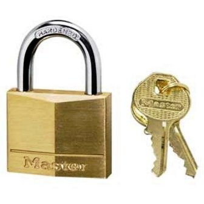
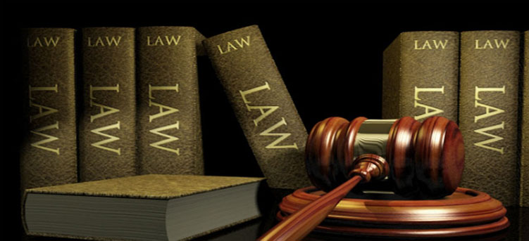

# Legal and Policy Issues

 
  *Photo Attribution: http://www.therealestatemedia.com/wp-content/uploads/2012/05/real-estate-investment-scam.jpg*
---

# Learning Outcomes

After completing this lesson, participants will be able to:

* Identify ethical, legal, and policy issues for managing research data
* Define copyrights, licenses and waivers
* Understand reasons behind data restrictions and how to observe them
* Discuss ethical considerations surrounding the use of research data

---

# Setting the Stage

* Legal – a law is “any written or positive rule or collection of rules prescribed under the authority of the state or nation.”
  * e.g., U.S. Copyright Act

* Ethical – “being in accordance with the rules or standards for right conduct or practice, especially the standards of a profession.”
  * e.g., IRB & IACUC

* Policy -  a specified “course of action adopted for the sake of expediency, facility, etc.”
  * e.g., Paperwork Reduction Act
  
	-- Definitions from Dictionary.com

???

IRB stands for Institutional Review Board and IACUC stands for Institutional Animal Care and Use Committee. Both are institutional structures, which exist to ensure that research meets the ethical standards of that institution and the scientific community.

The purpose of the  Paperwork Reduction Act remains to ensure that federal agencies do not overburden the public with federally sponsored data collections.

Resource for PRA: http://www.hhs.gov/ocio/policy/collection/infocollectfaq.html

---

# Intellectual Property (IP)

.one-half[

  *Photo Attribution: https://theforevergreenstateofmind.files.wordpress.com/2012/07/lightbulb3.png*
]

.one-half[
“Intellectual property refers to creations of the mind, such as inventions; literary and artistic works; designs; and symbols, names and images used in commerce.”
-- World Intellectual Property Organization
]

---

# What does IP include?

.one-half[

  *Photo Attribution: http://ecx.images-amazon.com/images/I/41DS66B06KL.jpg*
]

.one-half[
* Copyright
* Patents
* Trademarks
* Industrial Designs
]

???

Resource:  http://www.wipo.int/edocs/pubdocs/en/intproperty/450/wipo_pub_450.pdf

---

# Who might claim control over data?

.one-half[
* You
* A funder
* Student, scientist, researcher, PI
* An institution
* A private company
* Nobody
]

.one-half[

  *Photo Attribution: http://www.ihomepm.com/wp-content/uploads/2015/05/727453_10231848.jpg*
]

???

Who controls intellectual property? Think about where your data come from.  Who might have a claim on the data?  

Remember, stewardship doesn’t equal ownership.

Similarly, control over data does not lead to ownership.  Rights of control over data or access to data can be given without shifting ownership.

Example:  A data set, produced under a federal grant, contained within an institutional data repository may be owned by that institution.  The PI of the project that generated that data, while not the owner, maybe grants the authority to restrict or release access to that data, or limit the use of the data by others.  In this circumstance, the PI can claim control of the data without the ability to claim ownership. 

---

# Identifying Ownership and Control

.one-half[
Funder agreement
Institutional intellectual property policy
Private company data use agreement
Attached license
]

.one-half[

  *Photo Attribution: http://cdn.gobankingrates.com/wp-content/uploads/nashville-housing-market-overview-300x238.jpg*
]

???

Does the funder who paid for the research own the data?  Check the funder agreement to see who maintains ownership of the data.
 
The Bayh-Dole Act of 1980 made it possible for universities to maintain ownership of outputs from federally funded research projects.

Does the graduate student who collected the data have ownership? What about the Principle Investigator?  Check the IP policy of your institution.  Some institutions have clear policies on what students may take with them when they move on.  IP policies should also indicate when research outputs belong to the institution and when they belong to the researcher.
If access to the data for your research is provided through a private company, you will need to check the data use agreement to identify if they are maintaining ownership of that data.
Is there a license already attached to the data?  If there is a CC0 license attached, the data owner has waived all claims and it is in the public domain. This applies if you are using someone else’s data for your research. 

Most universities and government agencies have written policies that state that they retain ownership over all products produced by employees and contractors.  Faculty, staff, and students (usually graduate students) might retain copyright over their “traditional scholarly products”, but that term may refer to a narrow range of products and may not pertain to data or data products.  Rights may vary by discipline.

---

# Why Does Ownership & Control Matter?

.one-half[
* For Creators
   * to derive benefit as a result of their work
* For others
   * To avoid potential legal trouble
   * To know where to get permission for use.
]

.one-half[

  *Photo Attribution: Attention By Viktor Vorobyev at the Noun Project*
]

---

# Copyright versus License

Copyright: “ [T]he body of exclusive rights granted by law to copyright owners for protection of their work.” (U.S. Copyright Office)
* Facts and data* cannot be protected by copyright
* Metadata and data arrangement can be protected (sometimes)
* License: States what can be done with the data and how that data can be redistributed (e.g., GPL and CC)
* Waiver: (e.g., CC0) relinquishes all rights of ownership or control and usually commits the “work” to the public domain
* Intellectual property laws will vary depending upon country or region

???

You need to have copyright before you can have the power to assign licenses or waivers.

*The line between data that is “purely factual” vs descriptive is blurry and can be subjective at times.  In some cases, such as a biodiversity data set, much of the data may be considered to be purely factual (e.g., a place name, a species name) while other data within the same data set may contain descriptions of a place that, while being factual in nature, are actually the creative content of the individual(s) making the observations.  See Slide: Fact and Copyright for examples of current case law.

The arrangement or organization of data can be protected when the structure can be proven to be original.  Some arrangements, such as lists (e.g., the telephone book) cannot be protected by copyright.

Source: http://www.copyright.gov/help/faq/definitions.html
Reference: http://fairuse.stanford.edu/overview/faqs/copyright-basics/

---

# Fact and Copyright

* Facts cannot be protected by copyright, but what is a fact?
* Current case law determines the limits.
   * Feist Publications, Inc. vs. Rural Telephone Service Co.
   * Baker v. Seldon
   * Miller v. Universal Studios

  *Photo Attribution: http://www.romakerlaw.com/blog/wp-content/uploads/2015/07/doctelportal.jpg*
  
???

Feist vs. Rural:
From https://en.wikipedia.org/wiki/Feist_Publications,_Inc.,_v._Rural_Telephone_Service_Co.
Feist Publications, Inc., v. Rural Telephone Service Co., 499 U.S. 340 (1991), was a decision by the Supreme Court of the United Statesestablishing that information alone without a minimum of original creativity cannot be protected by copyright.[1] In the case appealed, Feist had copied information from Rural's telephone listings to include in its own, after Rural had refused to license the information. Rural sued for copyright infringement. The Court ruled that information contained in Rural's phone directory was not copyrightable and that therefore no infringement existed.

Baker vs. Seldon
From https://en.wikipedia.org/wiki/Baker_v._Selden
Baker v. Selden, 101 U.S. 99 (1879), was a leading Supreme Court of the United States copyright case cited to explain the idea-expression dichotomy. The court held that a book did not give an author the right to exclude others from practicing what was described in the book, only right to exclude reproduction of the material in the book. Exclusive rights to an "useful art" described in a book was only available by patent.

Miller v. Universal Studios
From https://en.wikipedia.org/wiki/Miller_v._Universal_City_Studios,_Inc.
Miller v. Universal City Studios, Inc., is a case where an appeals court found that although the plaintiff apparently deserved to prevail, it reversed the jury verdict and remanded the case for retrial because it found reversible error in the trial judges’ instructions to the jury. The appellate court found that the judge’s jury instructions, which included the statement that the labor of research by an author is protected by copyright, had been given in error. The court noted that plaintiff, over the objection of the defense, had urged the district court judge to include this instruction.

---

